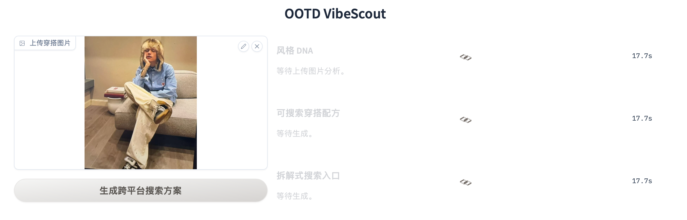
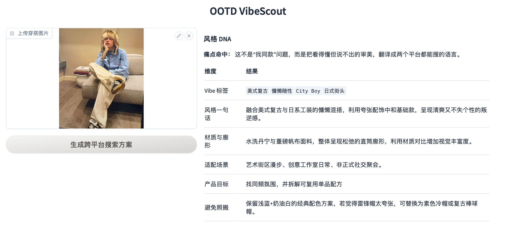
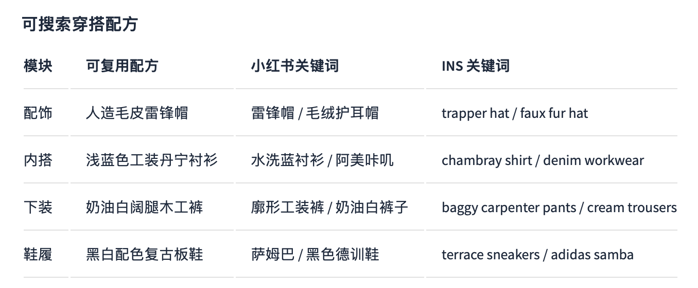
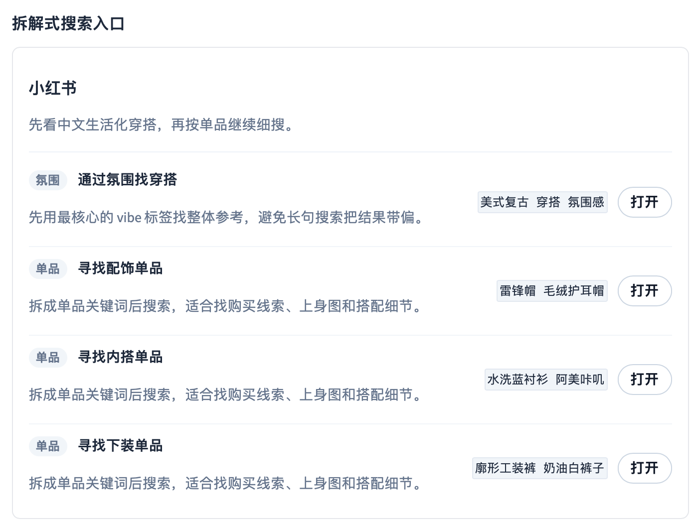
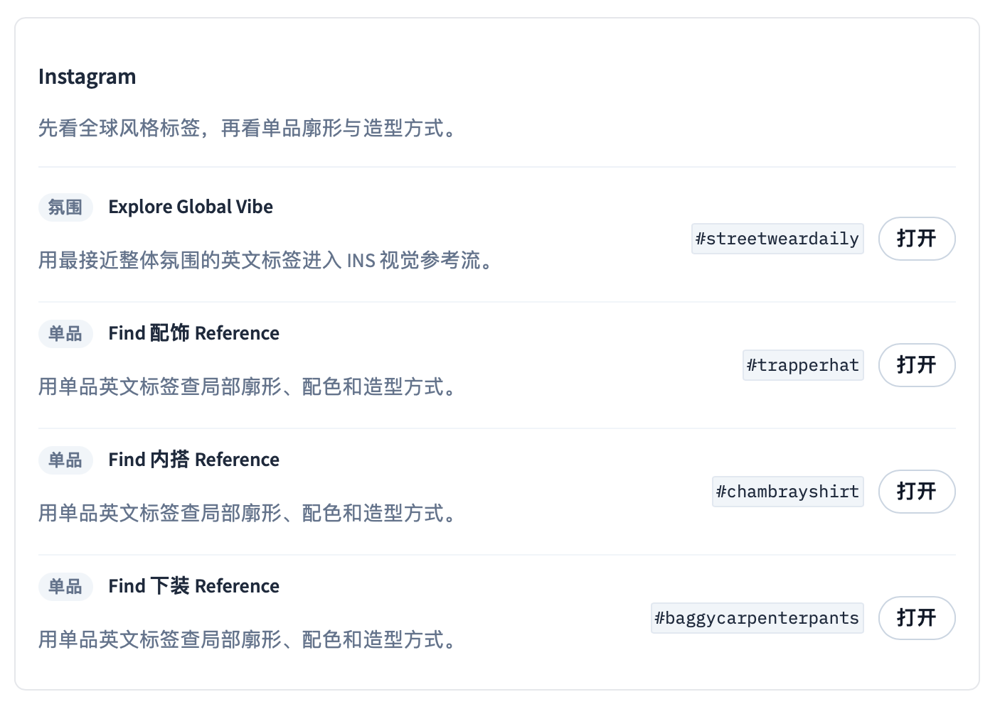
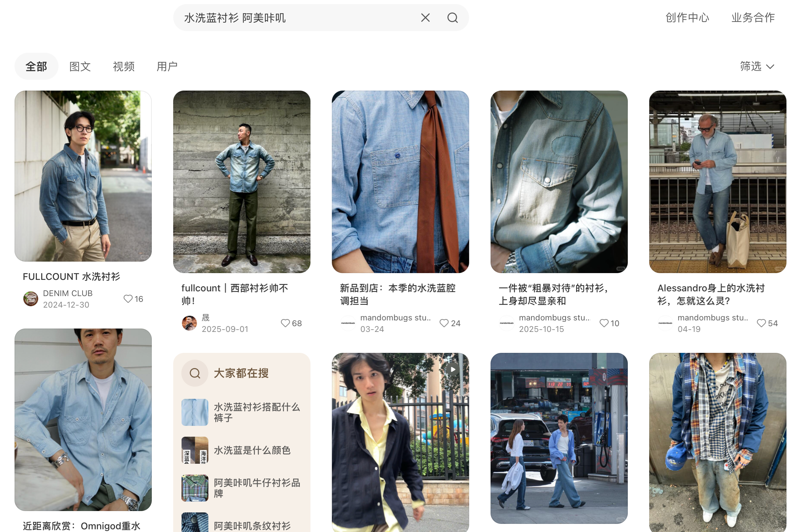
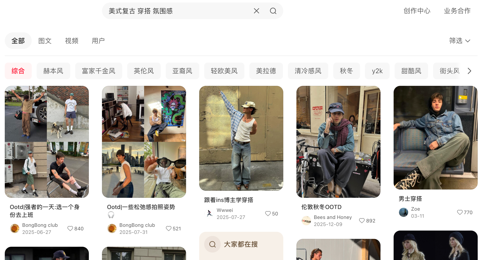
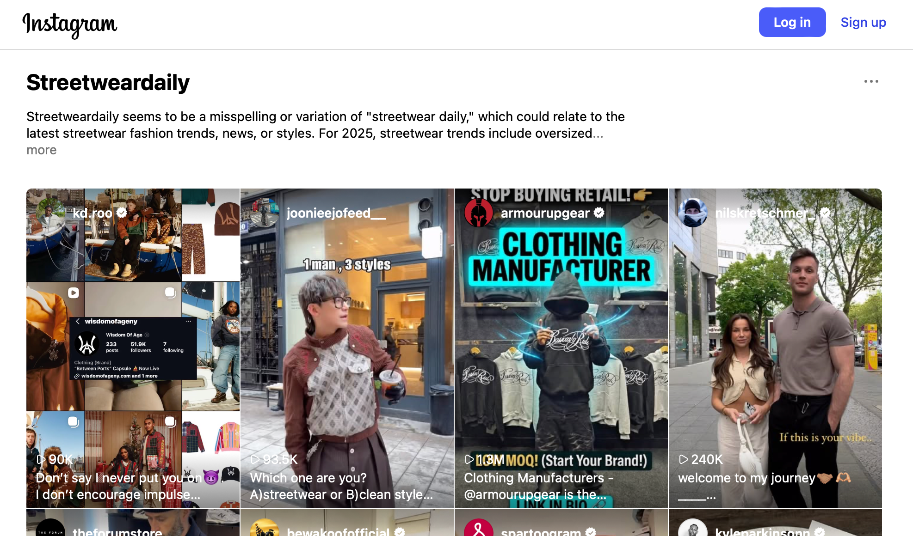
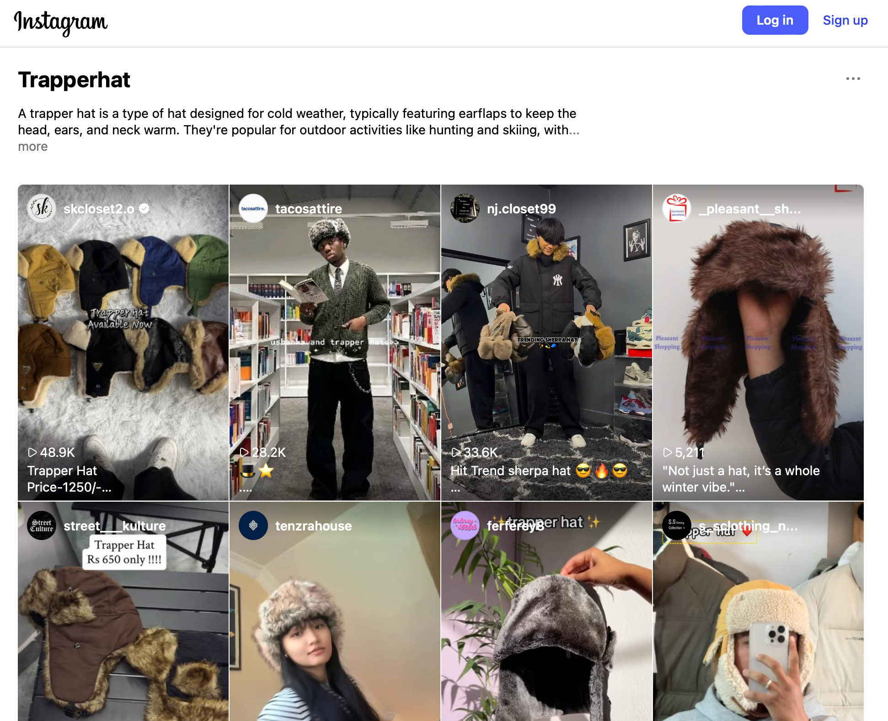

# OOTD VibeScout

AI 穿搭搜索翻译器：上传一张穿搭图，把“看得懂但说不出”的审美翻译成小红书中文搜索词和 Instagram 英文风格标签。

## 核心痛点

穿搭用户真正痛的不是“没有图片”，而是：

- 看到喜欢的穿搭，却说不出它到底是什么风格。
- 小红书和 Instagram 的审美语言不互通，同一种氛围在不同平台需要完全不同的搜索词。
- 用户往往不想一比一复刻，只想保留氛围、替换单品、降低撞款概率。
- 平台反爬和登录限制严重，直接抓真实笔记链接稳定性差。

因此本项目不把重点放在“爬到某几篇笔记”，而是做成 `Vibe-to-Query Translator`：把非结构化图片审美转成可解释、可调整、可点击的搜索策略。

## 产品方案

1. 上传穿搭图片。
2. MiniMax VLM 拆解风格 DNA、面料剪裁、场景和单品配方。
3. 默认生成同频氛围搜索策略，同时拆解可复用单品配方。
4. 输出拆解式稳定入口：
   - 小红书：一个氛围搜索入口 + 多个单品搜索入口。
   - Instagram：一个整体 vibe hashtag + 多个单品 hashtag 入口。

## Demo Walkthrough

1. 上传穿搭图，一键生成跨平台搜索方案。



2. VLM 将图片拆解为风格 DNA，而不是只做同款识别。



3. 输出可搜索的单品配方，把抽象审美落到具体关键词。



4. 小红书入口按“氛围”和“单品”拆开，避免长句搜索跑偏。



5. Instagram 入口同步拆成 vibe hashtag 和单品 hashtag。



6. 单品关键词可直接跳转到小红书，查购买线索与上身图。



7. 氛围关键词用于找整体穿搭参考。



8. 英文 vibe hashtag 用于补充全球风格参考。



9. 英文单品 hashtag 用于查局部廓形、材质和造型方式。



## 本地运行

```bash
cd /path/to/OOTD-Vibescout
./ootd/bin/python ootd/app.py
```

如果 `7874` 端口被占用：

```bash
GRADIO_SERVER_PORT=7875 ./ootd/bin/python ootd/app.py
```

如需真实调用 VLM，可以设置环境变量；如果未设置，应用会尝试读取 OpenClaw 本地配置 `~/.openclaw/config/minimax.json`：

```bash
export MINIMAX_API_KEY="your_api_key"
./ootd/bin/python ootd/app.py
```

如果两处都没有 API Key，应用会明确提示缺少密钥，不会返回固定兜底结果。这样可以保证面试演示时每次上传图片都是真实 VLM 解析。
